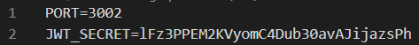
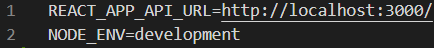

# REACT-Kanban functionnal documentation

- [REACT-Kanban functionnal documentation](#react-kanban-functionnal-documentation)
  - [API](#api)
  - [Client](#client)
  - [Manual project launch](#manual-project-launch)
  - [Running Tests](#running-tests)

## API

## Client

## Manual project launch

Open a terminal and type in :

- For both client and server: "`yarn run start`"

> OR, if you want them to run separately

- For the server: "`yarn workspace api run start`"
- For the client: "`yarn workspace client run start`"

---

## Running Tests

- In root folder go to folder _api_
- Open a CLI and `yarn tests`
