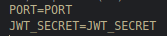

# How to install REACT-Kanban

- Clone / Download this project
- Open _Visual Studio Code_
- Open a CLI in _/root_ and install the dependencies with `yarn install`
- In both _/api_ and _/client_, rename the `.example.env` file into `.env` and fill in the keys.

api :

client : 

##  Manual project launch

Open a terminal and type in :
- For both client and server: "`yarn run start`"

> OR, if you want them to run separatly

- For the server: "`yarn workspace api run start`"
- For the client: "`yarn workspace client run start`"

---

##  Running Tests

- In root folder go to folder  _api_
- Open a CLI and `yarn tests`
