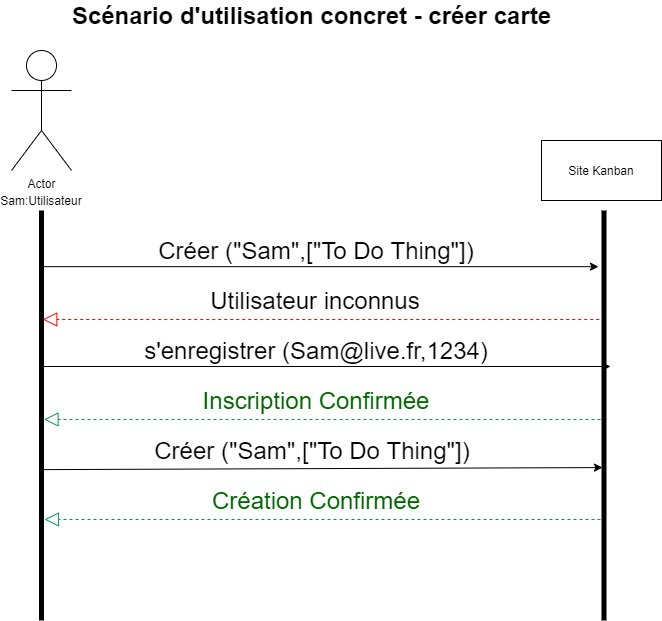

# Functional Documentation

- [Functional Documentation](#functional-documentation)
  - [Database modeling](#database-modeling)
    - [MCD](#mcd)
    - [MLD](#mld)
    - [MPD](#mpd)
  - [Use Case](#use-case)
    - [I. Creation of card or list](#i-creation-of-card-or-list)
    - [II. Consulting a card](#ii-consulting-a-card)
      - [Main Scenario](#main-scenario)
      - [1st Alternative Scenario](#1st-alternative-scenario)
      - [2nd Alternative Scenario](#2nd-alternative-scenario)
    - [III. Registration of a user](#iii-registration-of-a-user)
      - [Main Scenario](#main-scenario-1)
      - [Alternative Scenario](#alternative-scenario)
  - [Sequence diagrams](#sequence-diagrams)
  - [Architecture](#architecture)

## Database modeling

### MCD


### MLD


### MPD


## Use Case

### I. Creation of card or list


> Actor. **User**

The case starts when the customer clicks on _Create_.

- Main Scenario:

1. Triggering the case identify yourself

2. End of the case identify yourself

3. Triggering of the case fill in a title

4. End of the case fill in a title

5. 1. The object is a **list**
      Triggers the _create a list_ use case

   2. The object is a **card**
      Triggers the _create a card_ use case

- Alternative Scenario

  The user also chooses to create a card.
  The scenario returns to step 5.2

### II. Consulting a card


> Actor. **User**

The case starts when the client clicks on _Consult a card_

#### Main Scenario

1. Triggering of the case identify yourself

2. End of the case identify yourself

3. Triggering of the case to view information

4. End of the case to view the information

#### 1st Alternative Scenario

The user has chosen to delete the card. Triggers the _delete a card_ case

#### 2nd Alternative Scenario

The user has chosen to modify the information of the card. Triggers the _edit a card_ case

### III. Registration of a user


> Actor. **User**

The case starts when the client clicks on _register_

#### Main Scenario

1. Triggering of the case identify yourself

2. End of the case identify yourself

3. Triggers the _enter mail_ use case

4. End of the case of entering mail

5. Triggers the _enter password_ use case

6. End of password entry case

#### Alternative Scenario

7. Triggers the _error_ use case **if** user inserts wrong email or password

   Display of a message indicating the corresponding error

## Sequence diagrams




## Architecture

```tree
📦
├─ .github
│  └─ workflows
│     ├─ api-checks.yml
│     ├─ build.yml
│     └─ client-checks.yml
├─ .gitignore
├─ .nvmrc
├─ .vscode
│  └─ settings.json
├─ LICENSE
├─ README.md
├─ api
│  ├─ .eslintignore
│  ├─ .eslintrc.js
│  ├─ .prettierignore
│  ├─ .prettierrc
│  ├─ .vscode
│  │  └─ settings.json
│  ├─ example.env
│  ├─ index.js
│  ├─ jest.config.js
│  ├─ package.json
│  ├─ src
│  │  ├─ config
│  │  │  └─ ...
│  │  ├─ controllers
│  │  │  └─ ...
│  │  ├─ factory
│  │  │  └─ ...
│  │  ├─ middleware
│  │  │  └─ ...
│  │  ├─ models
│  │  │  ├─ ...
│  │  ├─ routes
│  │  │  └─ ...
│  │  ├─ services
│  │  │  └─ ...
│  │  └─ utils
│  │     └─ ...
│  └─ test
│     ├─ Cards
│     │  └─ ...
│     ├─ Lists
│     │  └─ ...
│     ├─ Users
│     │  └─ ...
│     ├─ cookie
│     │  └─ .gitkeep
│     ├─ index.js
│     └─ setupTest.js
├─ client
│  ├─ .eslintignore
│  ├─ .eslintrc
│  ├─ .gitignore
│  ├─ .prettierrc
│  ├─ assetsTransformer.js
│  ├─ babel.config.js
│  ├─ config
│  │  ├─ env.js
│  │  ├─ getHttpsConfig.js
│  │  ├─ jest
│  │  │  └─ ...
│  │  ├─ modules.js
│  │  ├─ paths.js
│  │  ├─ pnpTs.js
│  │  ├─ webpack.config.js
│  │  └─ webpackDevServer.config.js
│  ├─ example.env
│  ├─ jest.config.js
│  ├─ jest.setup.js
│  ├─ package.json
│  ├─ public
│  │  └─ ...
│  ├─ scripts
│  │  └─ ...
│  ├─ src
│  │  ├─ App.css
│  │  ├─ App.test.tsx
│  │  ├─ App.tsx
│  │  ├─ authPages
│  │  │  ├─ components
│  │  │  │  └─ ...
│  │  │  ├─ i18n
│  │  │  │  └─ ...
│  │  │  └─ index.ts
│  │  ├─ cardDetailsModal
│  │  │  ├─ components
│  │  │  │  └─ ...
│  │  │  ├─ hooks
│  │  │  │  └─ ...
│  │  │  ├─ i18n
│  │  │  │  └─ ...
│  │  │  ├─ index.ts
│  │  │  ├─ interfaces
│  │  │  │  └─ ...
│  │  │  └─ services
│  │  │     └─ ...
│  │  ├─ core
│  │  │  ├─ adapters
│  │  │  │  └─ ...
│  │  │  ├─ assets
│  │  │  │  └─ ...
│  │  │  ├─ components
│  │  │  │  └─ ...
│  │  │  ├─ dto
│  │  │  │  └─ ...
│  │  │  ├─ fonts
│  │  │  │  └─ ...
│  │  │  ├─ hooks
│  │  │  │  └─ ...
│  │  │  ├─ i18n
│  │  │  │  └─ ...
│  │  │  ├─ index.ts
│  │  │  ├─ interfaces
│  │  │  │  └─ ...
│  │  │  └─ services
│  │  │     └─ ...
│  │  ├─ i18n
│  │  │  ├─ i18n.ts
│  │  │  ├─ index.ts
│  │  │  └─ resources.ts
│  │  ├─ index.css
│  │  ├─ index.tsx
│  │  ├─ landingPage
│  │  │  └─ ...
│  │  ├─ language
│  │  │  └─ ...
│  │  ├─ logo.svg
│  │  ├─ modal
│  │  │  └─ ...
│  │  ├─ react-app-env.d.ts
│  │  ├─ reportWebVitals.ts
│  │  ├─ routeManager
│  │  │  ├─ components
│  │  │  │  ├─ ...
│  │  │  │  └─ index.ts
│  │  │  └─ index.ts
│  │  └─ setupTests.ts
│  └─ tsconfig.json
├─ docs
│  ├─ FUNCTIONAL_DOCUMENTATION.md
│  └─ media
│     └─ ...
├─ package.json
├─ scripts
│  └─ ...
├─ sonar-project.properties
└─ ts-kanban.code-workspace
```
