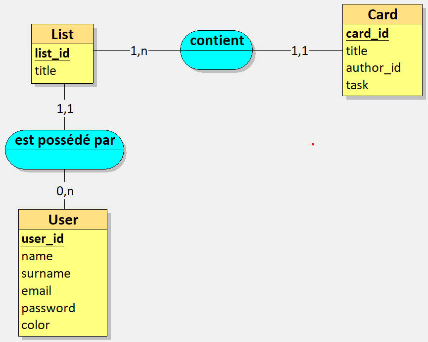
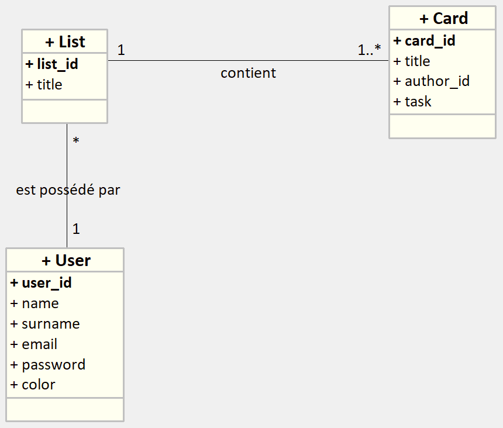
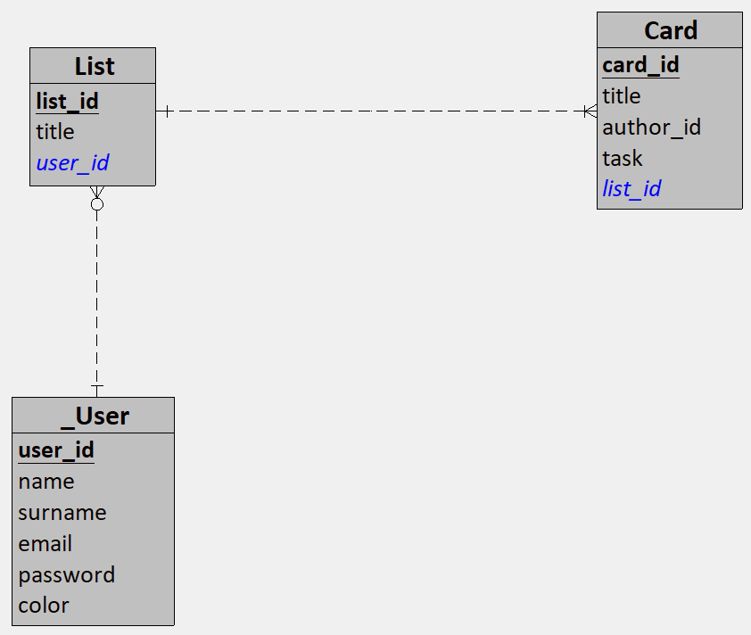
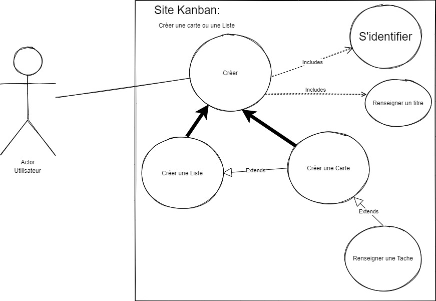
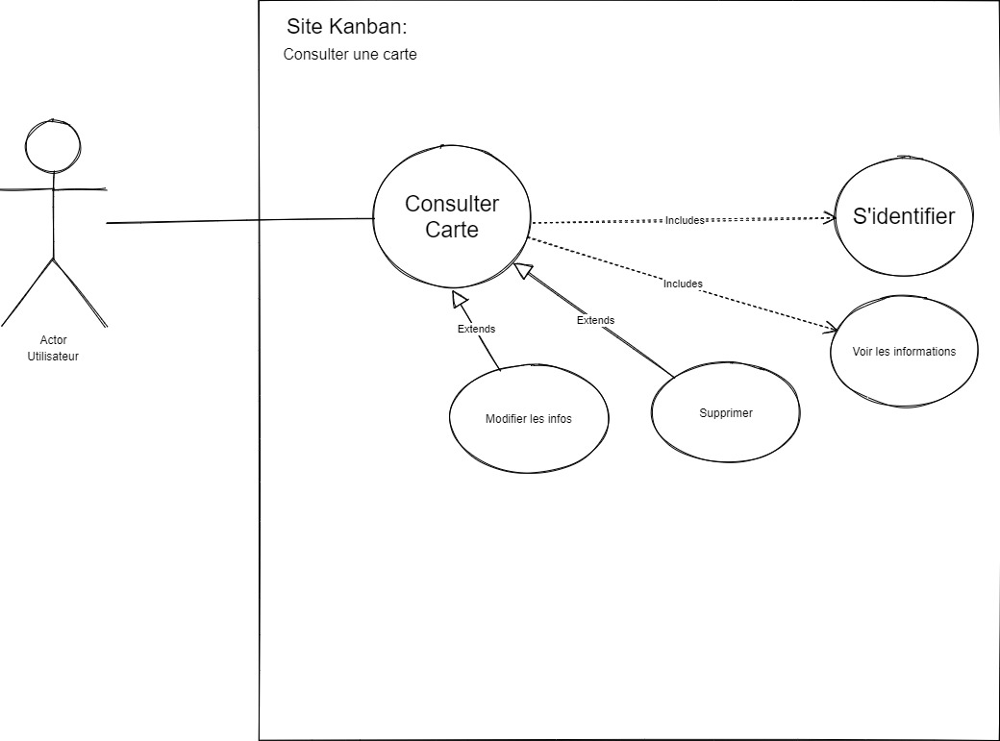
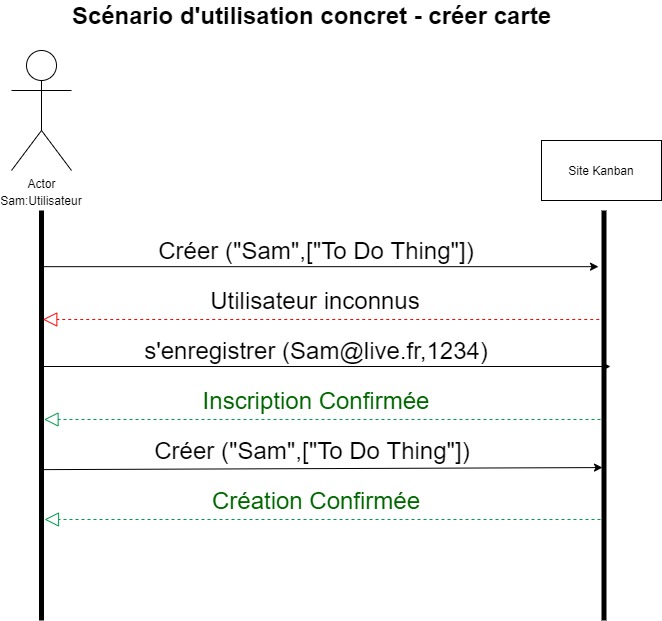

# Architecture

## Database modeling

### MCD

### MLD

### MPD

## Use Case:

### I. Creation of card or list

> Actor. **User**

The case starts when the customer clicks on *Create*.

- Main Scenario:

1. Triggering the case identify yourself

2. End of the case identify yourself

3. Triggering of the case fill in a title

4. End of the case fill in a title

5. 1. The object is a **list**
	Triggers the *create a list* use case

   2. The object is a **card**
	Triggers the *create a card* use case

- Alternative Scenario

	The user also chooses to create a card.
	The scenario returns to step 5.2

### II.	Consulting a card 

> Actor. **User**

The case starts when the client clicks on *Consult a card*

#### Main Scenario:

1. Triggering of the case identify yourself

2. End of the case identify yourself

3. Triggering of the case to view information

4. End of the case to view the information

#### 1st Alternative Scenario

The user has chosen to delete the card. Triggers the *delete a card* case

#### 2nd Alternative Scenario

The user has chosen to modify the information of the card. Triggers the *edit a card* case

### III. Registration of a user

> Actor. **User**

The case starts when the client clicks on *register*

#### Main Scenario:

1. Triggering of the case identify yourself

2. End of the case identify yourself

3. Triggers the *enter mail* use case

4. End of the case of entering mail

5. Triggers the *enter password* use case

6. End of password entry case

#### Alternative Scenario

7. Triggers the *error* use case **if** user inserts wrong email or password

	Display of a message indicating the corresponding error

## Sequence diagrams

